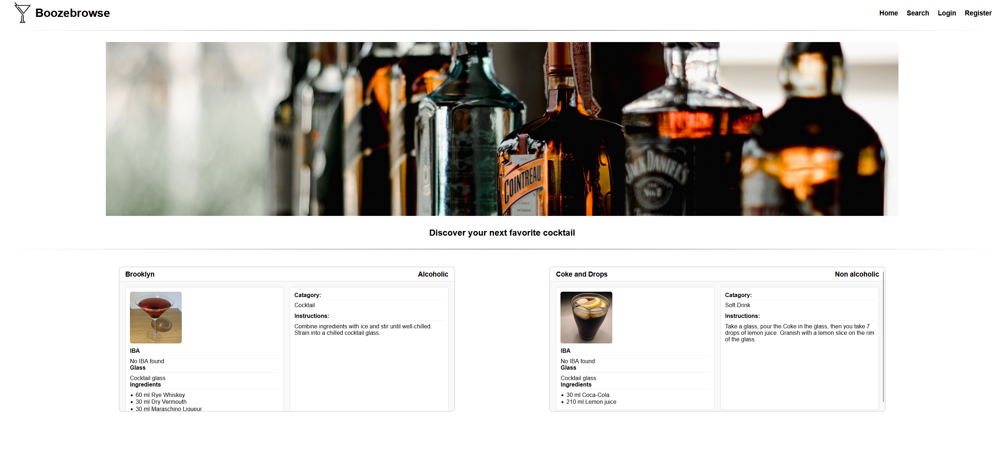

**Inhoudsopgave**
1. Inleiding
2. Benodigdheden
3. Installatie
4. Inloggen
5. Overige NPM-commando's

**Inleiding**

Boozebrowse is een webapplicatie waarmee gebruikers cocktails kunnen ontdekken, zoeken en opslaan als favoriet. De app
biedt verschillende manieren om cocktails te vinden: op naam, op ingrediënt, op de eerste letter van de cocktail, of
door een willekeurige cocktail te bekijken. Voor iedere cocktail wordt uitgebreide informatie weergegeven, zoals de
ingrediënten, hoeveelheden in milliliter, bereidingswijze, het type glas en de alcoholstatus.

**Benodigdheden**
Om Boozebrowse lokaal te kunnen draaien, is Node.js versie 18 of hoger nodig, samen met npm, dat standaard bij Node.js
wordt geleverd. De applicatie heeft een internetverbinding nodig om gegevens op te havlen via de API's. In de root van
het project moet een .env file aanwezig zijn met de volgende variabelen:

* VITE_API_KEY=9973533
* VITE_API_URL=https://www.thecocktaildb.com/api/json/v2/
* VITE_API_NOVI_KEY=boozebrowse:i8p9bzse5z4muZnlQ5Kd
* VITE_API_NOVI_URL=https://novi-backend-api-wgsgz.ondigitalocean.app/
* VITE_API_PROJECT_KEY=4a908188-c3b9-45d3-adf8-df65712b9955

Daarnaast heeft de backend van de applicatie een JSON-bestand nodig dat als database fungeert. Dit bestand bevindt zich
in het project onder src/assets/testfiles/sjon.json en bevat gebruikersinformatie en favorieten. Het is belangrijk dat
dit bestand aanwezig is voordat de applicatie wordt opgestart.

Dit bestand kan worden geupload op https://novi-backend-api-wgsgz.ondigitalocean.app/ onder het kopje **API
configureren **. Hier kan het JSON bestand worden geupload en het project ID (
VITE_API_PROJECT_KEY=4a908188-c3b9-45d3-adf8-df65712b9955).

**Installatie**
Clone eerste de repository naar je lokale machine of naar een eigen repository en ga naar de projectmap. Installeer
vervolgens alle dependencies met _npm install_. Voeg de _.env_ file toe in de root van het project zoals hierboven
beschreven. Start de ontwikkelomgeving door in de terminal _npm run dev_, waarmee de applicatie beschrikbaar wordt op
localhost. Open de link die je in de terminal ziet om de applicatie te bekijken en te gebruiken. Mocht je veranderingen
aanbrengen in het .env file is het noodzakelijk de omgeving opnieuw op te starten.

Om de backend correct te laten functioneren, is het belangrijk dat het project ID en de API key van NOVI worden gebruikt
zoals beschreven in de documentatie van de NOVI Dynamic API. De Swagger UI van jouw project kan gebruikt worden om de
API te testen en de database-instellingen te controleren.

**Inloggen**
Voor het testen van de favoriet-functie en de profielpagina gebruikt kan er gebruik worden gemaakt van het testaccount
met e-mail regular.user@example.com en wachtwoord regular123. Nieuwe accounts kunnen gemaakt worden om de API te testen.

**Overige NPM-commando's**
De belangrijkste commando's voor dit project zijn _npm run dev_ om de ontwikkelomgeving op te starten, _npm run build_
om een productieversie te maken, en npm run preview om de productiebuild lokaal te bekijken. Voor codekwaliteit kan _npm
run lint_ worden gebruikt. Het commando _npm install_ zal alle dependencies zoals gedefinieerd in package.json
installeren. Voor ontwikkeling voldoet _npm run dev_.

Link naar repository: https://github.com/MexNL/boozebrowse#